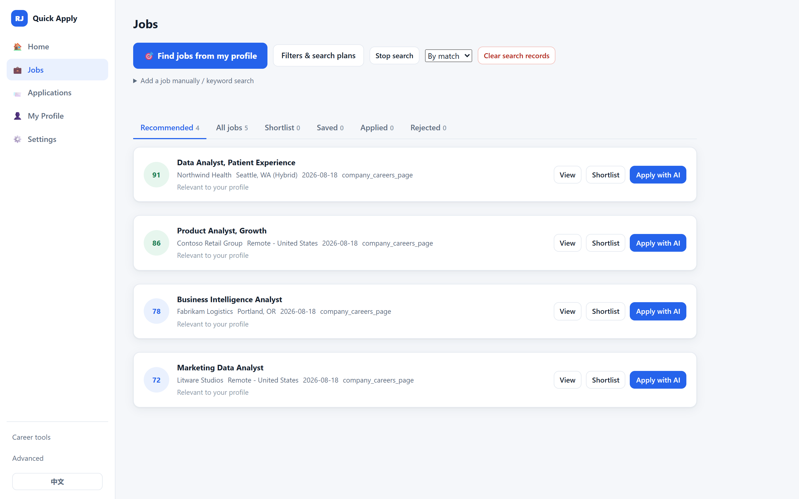
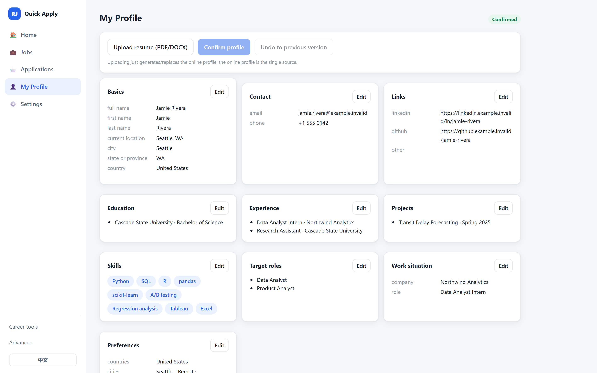
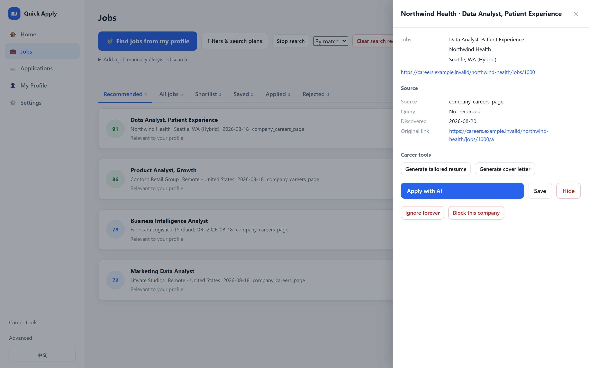

# Resume Jobs AI

> Find jobs across the web, see exactly **why** each one matches you, generate a
> resume that **never invents facts**, and autofill the application — all on
> your own machine, with **you** clicking Submit.

[](https://nodejs.org/)

[](LICENSE)
[](SECURITY.md)

**English** · [简体中文](README.zh-CN.md)



*The in-app UI is titled **Quick Apply** — same product, shorter name.*

<!-- demo-gif: replace the image above with docs/images/demo.gif once recorded.
     Shot list and timings: docs/demo/DEMO_SCRIPT.md -->

## Try it in two minutes

```bash
git clone https://github.com/Kerrylala/resume_jobs_quick_apply.git
cd resume_jobs_quick_apply
npm install && npm run demo
```

The demo is fully synthetic and offline: fake candidate, fake jobs, a fake
application form on localhost. Nothing real is read, contacted, or submitted.

## What it does

- **Web-wide job discovery** — searches company career pages and public
  applicant-tracking-system (ATS) job boards, or imports any public job URL
  you paste.
- **Explainable matching** — every score decomposes into skills, experience,
  education, location, and seniority. A genuine gap is named, never hidden.
- **Grounded resume & cover-letter tailoring** — generated documents may only
  say what your approved profile actually contains. AI output that invents a
  skill, number, or employer is rejected wholesale and falls back to a
  deterministic version.
- **Application autofill** — fills the fields you confirmed, across multi-step
  forms, in your own browser (extension) or a visible dedicated one.
- **Answer memory** — a question you answer once is remembered with your
  approval and reused on the next application that asks it.
- **Local-first** — your resume, profile, answers, and history are local files.
  AI is optional: bring a local model (LM Studio / Ollama) or your own API key.
- **You submit** — the product never clicks Submit, never logs in, never
  touches CAPTCHA or multi-factor (MFA) prompts.

## Why Resume Jobs?

Most auto-apply tools are cloud services that rewrite your resume freely and
fire applications you never saw. This project takes the opposite side of every
one of those trades:

| Typical auto-apply bot | Resume Jobs |
|---|---|
| Your resume and history live on someone's server | Everything is a local file on your machine |
| "93% match" with no reasoning | Score broken down by dimension, with named gaps |
| LLM freely rewrites your resume — invented skills included | Facts-only tailoring: ungrounded output is rejected in full, enforced by code and tests |
| Answers the same questions from scratch every time | Confirmed answers are versioned and reused |
| Submits on your behalf | Stops at every login, CAPTCHA, sensitive question — and always at Submit |

## Quick start

Requirements: Windows 11 / macOS / Linux, Node.js 18+, Chrome or Edge.

```bash
git clone https://github.com/Kerrylala/resume_jobs_quick_apply.git
cd resume_jobs_quick_apply
npm install
npm start
```

Open [http://127.0.0.1:8767](http://127.0.0.1:8767), upload a resume, review
what was parsed, and click **Find jobs from my profile**. Windows users can
double-click `dist/ResumeJobs Launcher.cmd` instead. Full first-run
walkthrough: [quick_start.md](docs/user/quick_start.md).

## Screenshots

Every screenshot uses a synthetic candidate and fictional employers.

| Your profile is the single source of truth | Every job keeps its receipts |
|---|---|
|  |  |

Target roles, education, experience, projects, and skills are versioned and
editable, and they drive matching, the tailored resume, and search. Each job
keeps the evidence of where it came from — source, query, discovery time,
original link. A senior role that fits an early-career profile poorly is kept
out of **Recommended** instead of being quietly dropped.

## AI providers

AI is optional and off by default — the deterministic product is complete
without it. When you enable it ([Settings](docs/images/settings.png)), point it
at:

- a **local model** via LM Studio or Ollama (auto-detected), or
- **your own API key** for OpenAI, Anthropic, or any OpenAI-compatible HTTPS
  endpoint.

Tailoring, cover-letter, and matching requests carry only the job posting and
the specific confirmed facts each task needs — never your contact details.
Enabling AI at resume upload sends the resume text you chose to upload to the
provider **you** configured, and nowhere else. Keys never leave your machine.
Deterministic checks own every gate and approval: when AI is on, match scores
blend in a clearly labeled semantic opinion, but it can never lift a job past
a failed hard filter, approve a job, or advance an application.

## Safety & privacy

Resume Jobs is not an unattended auto-submit bot.

- Final Submit is never clicked automatically; login, CAPTCHA, MFA, and
  verifications always stop for you.
- Sensitive and high-risk answers require your explicit confirmation.
- Generated resumes and letters are grounded: every claim traces to a fact you
  approved.
- All personal data stays in local files that Git ignores; cloning this repo
  can never carry anyone's candidate data.
- Destructive actions archive first — **Delete all user data** copies every
  store into `archive/` before wiping.

Details and threat model: [SECURITY.md](SECURITY.md).

## Architecture in one paragraph

A local Node.js dashboard (no build step) owns all state as versioned JSON
files and serves a bilingual web UI. Matching, resume parsing, tailoring, and
search planning are deterministic modules with AI as an optional, validated
layer on top. Two interchangeable fill executors — a Chrome extension and a
visible Playwright-driven browser — share one field-mapping, safety-policy, and
reporting contract. ~460 offline tests pin the behavior, including the safety
rules. Deep dive: [Architecture](docs/architecture/ARCHITECTURE.md) ·
[Product tour](docs/user/PRODUCT_TOUR.md).

## Roadmap

- **Now** — explainable search & matching, grounded tailoring (experimental
  label in UI), multi-step autofill, answer memory, bilingual UI and docs.
- **Next** — demo video, broader ATS coverage and field-widget support,
  packaged one-click install, richer cover-letter styles.
- **Later** — multiple profiles, pluggable job sources, community field
  mappings.

## Current limitations

Honest notes before you rely on it:

- Some portals require login or human verification mid-flow — the product
  stops and waits for you; it will not try to get past them.
- ATS coverage varies: Greenhouse, Lever, and Ashby are first-class; Workday is
  discovery-only; unusual custom widgets may need manual filling.
- Job discovery depends on public sources being reachable; login-walled boards
  are surfaced as leads rather than full postings.
- Resume tailoring is marked **experimental** in the UI: quality depends on the
  AI model you bring, and the grounded fallback is plainer prose.
- The dashboard is bilingual (English/Chinese), but the page-side Assistant
  chip and the extension popup are currently Chinese-only.
- Developed and tested most heavily on Windows; macOS/Linux get the same
  offline test suite but less real-world mileage.
- Final submission is always manual — by design, not as a missing feature.

## Documentation & contributing

[Product tour](docs/user/PRODUCT_TOUR.md) ·
[Quick start](docs/user/quick_start.md) ·
[User guide](docs/user/USER_GUIDE_EN.md) ·
[Extension guide](docs/user/EXTENSION_GUIDE.md) ·
[Browser Agent guide](docs/user/BROWSER_AGENT_GUIDE.md) ·
[Architecture](docs/architecture/ARCHITECTURE.md) ·
[AI provider contract](docs/developer/AI_PROVIDER.md) ·
[Docs index](docs/INDEX.md)

中文文档: [README](README.zh-CN.md) · [贡献指南](CONTRIBUTING.zh-CN.md) ·
[安全与隐私](SECURITY.zh-CN.md) · [更新日志](CHANGELOG.zh-CN.md) ·
[用户指南](docs/user/USER_GUIDE_CN.md)

Contributions welcome — start with [CONTRIBUTING.md](CONTRIBUTING.md) and keep
`npm test` green. Release notes: [CHANGELOG.md](CHANGELOG.md) ·
[v1.0.0-rc.1 notes](docs/release/V1_RC1_RELEASE_NOTES.md).

## License

[MIT](LICENSE)
