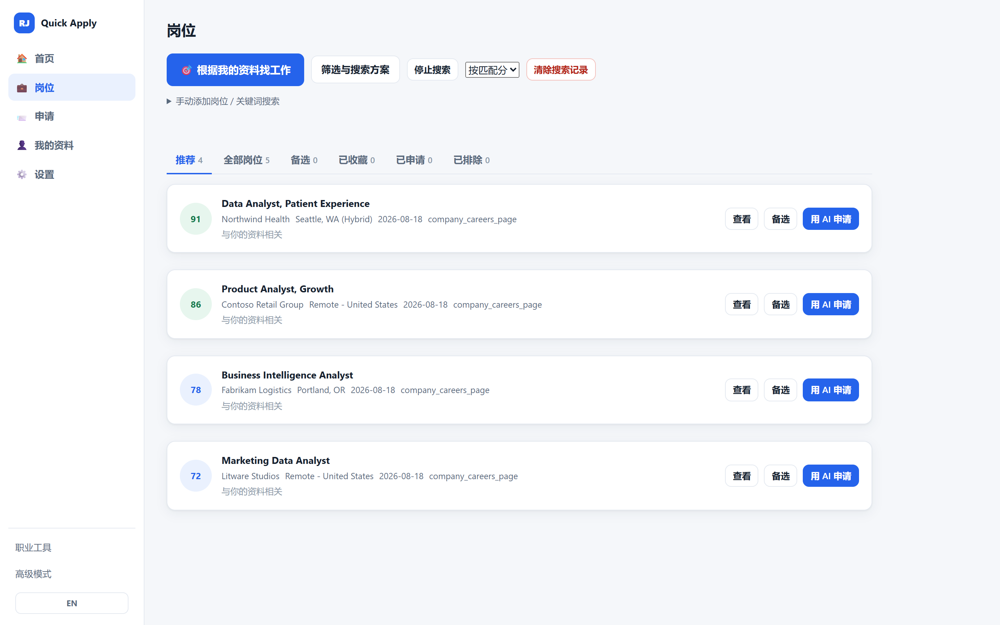
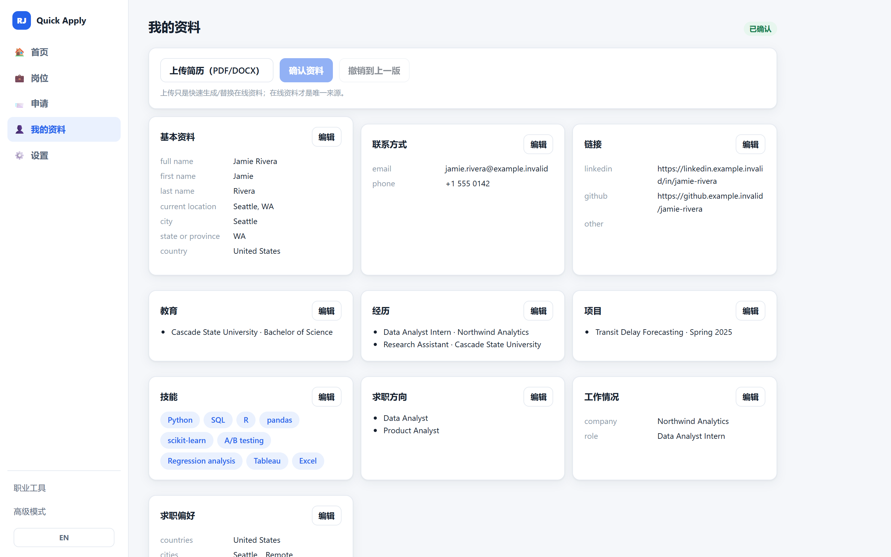
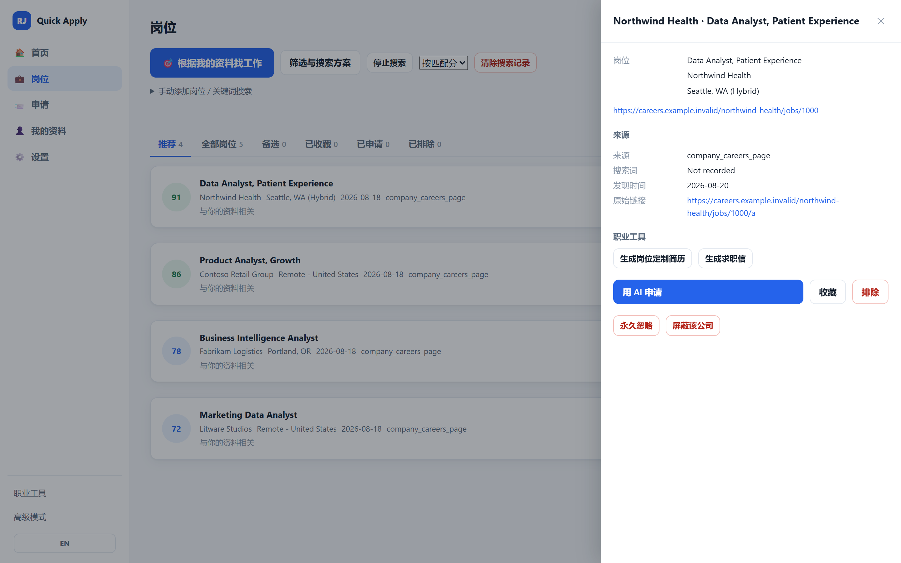

# Resume Jobs AI

> 本地优先的 AI 求职助手：把你认可的岗位变成可复核的申请材料，同时把个人事实、
> 敏感回答、浏览器操作和最终提交牢牢留在你自己手里。

[](https://nodejs.org/)

[](LICENSE)
[](SECURITY.zh-CN.md)

[English](README.md) · **简体中文**



Resume Jobs 帮助一个人建立带版本的**职业大脑**、搜索国内与海外机会、理解确定性与
语义两层匹配质量、生成申请材料包，并用内置浏览器扩展或可见的本地浏览器助手填写
已知字段。

产品的北极星指标是**申请完成率**：在你接手之前，一份已批准的申请能被安全完成的比例。

## 产品能力

- **简历理解**导入带版本的 PDF、DOCX、UTF-8 TXT 简历，抽取仅供复核的事实，并记录
  来源与置信度。
- **职业大脑**保存经你批准的、带版本的身份信息、教育、经历、项目、分组技能、语言、
  偏好、求职方向与面试故事，是产品唯一的候选人知识来源。
- **候选人感知匹配**评估技术契合、经验、学历、地点、薪资与职业方向，绝不编造缺失事实。
- **岗位发现代理**推导直接匹配与有证据支撑的可迁移岗位，在执行前展示目标/相邻职位、
  地点、关键词、来源与查询理由，支持 SearXNG、公开申请页/公司招聘页直链，以及完全
  合成的本机演示。
- **混合匹配**把权威的确定性门槛与建议性的语义评分、优势、差距、置信度结合起来，
  再区分即时契合、职业成长价值、技能差距与投/考虑/不投的建议。
- **答案记忆**为你确认过的回答做版本管理；模型的猜测在复核前永远是未确认状态。
- **表单字段记忆**学习去值化的字段映射，只复用你确认过的映射关系。
- **申请材料包 2.0**把一个已批准岗位与已批准的职业档案、最合适的简历、确认过的答案、
  求职信状态、面试准备、风险、安全门与完成度估计绑定在一起。
- **两种安全的申请执行器**共用同一套材料包、字段映射、门户适配器、安全策略与报告：
  Chrome 扩展是推荐的日常模式，本地浏览器助手打开一个可见的专用会话用于进阶诊断。
  两者都会在登录、验证码、MFA、未知或敏感问题、简历附件与最终提交处停下。
- **可选的 AI 供应商**支持本机 OpenAI 兼容端点、OpenAI、Anthropic，或其他 HTTPS
  OpenAI 兼容端点。AI 始终是建议性的：评分、批准和流程状态由确定性代码掌管。

## 产品预览

以下截图全部使用合成候选人与虚构公司。

| 你的资料是唯一事实来源 | 每个匹配都能自证来历 |
|---|---|
|  |  |

**求职方向**、教育、经历、项目与技能都带版本、可编辑，并直接驱动匹配、定制简历的
总结句和搜索。每个岗位都保留它的来历证据——来源、查询词、发现时间、原始链接——
所以推荐永远不是一个没有上下文的数字。上面列表里那个 41 分的资深岗位，对一份应届
生资料会被挡在**推荐**之外，而不是被悄悄丢掉。

AI 是可选的：在[设置](docs/images/settings.zh.png)里可以指向本机模型或你自己的
API Key，不配置也能完整使用产品。

## 快速开始

环境要求：

- Windows 11、macOS 或 Linux
- Node.js 18 或更新版本
- Chrome 或 Microsoft Edge（用于浏览器辅助和本机端到端演示）

```bash
git clone https://github.com/Kerrylala/resume_jobs_quick_apply.git
cd resume_jobs_quick_apply
npm install
npm start
```

打开 [http://127.0.0.1:8767](http://127.0.0.1:8767)。

Windows 用户可以双击 `dist/ResumeJobs Launcher.cmd`。完整的首次运行流程与桌面
快捷方式说明见[中文安装指南](docs/user/中文安装指南.md)。

## 首次使用流程

```text
上传简历
  -> AI 辅助生成职业大脑草稿
  -> 复核、版本化并批准职业档案
  -> 创建求职搜索
  -> 搜索岗位或导入一个公开岗位链接
  -> 复核可解释的匹配结果
  -> 批准选中的岗位
  -> 生成并复核申请材料包
  -> 批准 AI 填写
  -> 打开申请页并使用 AI 填写助手
  -> 处理未知问题、敏感问题、登录、验证码或 MFA
  -> 复核填好的表单
  -> 由你手动提交
```

流程步骤由当前的领域记录推导得出。浏览器缓存、演示标记和旧报告不参与判断当前处于
哪一步。

## 日常使用

首页是每天的起点：它汇总职业大脑的就绪度、仍待复核的高分岗位、进行中的申请，以及
最安全的下一步动作。匹配卡片会把发现证据（来源类别、查询词、搜索时间、发现理由、
供应商）放在契合度解释旁边，所以推荐永远有上下文。

发现来源使用一套可见的分类：

- 国内：公司招聘站、公开岗位页、用户导入的链接。
- 海外：公开申请表单与公司招聘页。

材料包复核会在浏览器辅助开始之前，展示所选简历版本、求职信状态与预览、准备好的
面试问题、确认过的 STAR 故事、缺失技能和未解决的风险。

## 试试完整的离线演示

```bash
npm run demo
```

演示使用合成数据、隔离的临时目录和一个本机假申请表单。它不会读取你的个人资料、
不联系任何真实招聘网站、不上传简历、也不提交申请。

## 浏览器扩展

把 `extensions/application_assistant` 作为解压的 Manifest V3 扩展加载。它可以在
公开申请页上运行——包括公司自建的招聘域名，而不只是几家大 ATS 厂商——并且在你
发起填写之前保持休眠。

**只有当页面所属的主机属于一个活跃的填写会话时，这个页面的网址才会到达本机 app。**
扩展会向 app 询问哪些主机处于活跃状态（这个请求本身不携带任何页面信息），在其他任何
地方都保持沉默，所以你的日常浏览不会被上报到任何地方。

点击**启动 AI 填写助手**之后，只有当前打开的页面属于所选岗位，弹窗才会收到复核过的
申请配置。它不会收到简历文件字节，也没有最终提交权限。简历附件始终是一个单独的、
需要明确确认的手动动作。

在页面本身上，助手会显示一个小角标，展示实时申请状态，并带两个按钮：**填写这一步**
和**重新扫描**，供你不想等自动周期的时候使用。

在**设置 → 扩展连接**里可以核对已安装的扩展、连接状态、当前页面和匹配到的申请。
技术传输细节与标识符只在**高级诊断**里展示。Resume Jobs 使用本机 HTTP，不需要
Native Messaging。

## 申请执行器模式

在复核已批准的材料包时选择执行器：

- **Chrome 扩展（推荐）**在你的常用浏览器里打开那个已批准的准确网址。弹窗显示公司、
  职位、简明就绪状态、检测/已填/跳过数量，以及需要你复核的字段。
- **本地浏览器助手（进阶）**用一个专用的、被忽略的配置文件启动可见的 Chrome/Edge
  窗口。它会拍摄填写前后的截图、写出脱敏的执行报告、填写同样的安全字段，然后保持
  浏览器打开等你复核。

两种模式都支持**分步申请**：当门户带你走过好几页时，每个新步骤都会被检测到、等待
页面稳定，然后用你确认过的答案填写一次。导航权始终属于你——产品永远不会替你点击
**下一步**、**保存并继续**或**提交**。

这两种模式不是两个产品：它们消费同一份复核过的材料包、遵循同一套安全规则、返回同样
脱敏的结果。参见[扩展指南](docs/user/EXTENSION_GUIDE.md)与
[浏览器助手指南](docs/user/BROWSER_AGENT_GUIDE.md)。

## 安全模型

Resume Jobs 不是一个无人值守的自动投递机器人。

- 绝不自动点击最终提交。
- 登录、验证码、MFA 与各类验证一律停下来交给你。
- 申请执行器从不上传、也从不接收简历文件字节。
- 敏感与高风险回答必须经你确认。
- AI 不能修改确定性评分、不能批准岗位、不能推进申请状态。
- 访问真实站点、登录、上传简历与提交，都需要你的明确授权。

在真实申请上使用浏览器辅助之前，请先阅读 [SECURITY.zh-CN.md](SECURITY.zh-CN.md)。

## 你的数据留在你自己的机器上

- 你输入的一切——简历、资料事实、答案、申请记录、浏览器会话——都写在 `data/`、
  `documents/`、`browser_profiles/` 下的本地文件里，不会上传到任何地方。
- 这些目录被 Git 排除在外，所以克隆或 fork 这个仓库永远不会带上任何人的候选人数据。
- AI 是可选的，且默认关闭。启用后，只有岗位描述和某个任务确实需要的那几条事实会发给
  **你自己配置的**供应商（本机模型，或你自己的 API Key）。联系方式从不进入 AI 请求。
- 破坏性操作先归档：**删除全部用户数据**会在清空前把每个数据文件复制到 `archive/`，
  所以误点也能找回。

## 项目结构

```text
dashboard/                   本机控制台与 HTTP API
application_executor/        共用的字段映射、安全策略、执行器与报告契约
portal_adapters/             Lever、Greenhouse、Ashby 与通用适配器
browser_agent/               可选的可见 Playwright 传输层
extensions/application_assistant/
                             AI 填写助手与表单字段记忆
providers/                   公开岗位来源与供应商识别
scripts/lib/                 产品领域与持久化模块
scripts/                     命令行、启动器、发现、评分与材料包工具
tests/                       离线单元、集成、浏览器与端到端测试
mock_sites/                  仅限本机的 ATS 测试站点
data/                        本地运行状态；私有数据被忽略
```

## 开发与验证

```bash
npm run validate
npm test
npm run test:e2e
npm run test:browser
npm run test:browser-agent
```

默认测试套件会装上网络与项目写入的守卫。测试使用合成输入和临时数据目录，不会读取或
改写正式的岗位、资料、简历与申请数据。

`npm run test:real-portals` 被有意排除在离线套件之外。它只对当前公开的 Greenhouse 与
Lever 表单字段契约做只读检查，绝不写入值、上传简历、登录或提交。

## 文档

- [English README](README.md) · [English contributing](CONTRIBUTING.md) ·
  [English security](SECURITY.md) · [English changelog](CHANGELOG.md)
- [中文贡献指南](CONTRIBUTING.zh-CN.md) · [中文更新日志](CHANGELOG.zh-CN.md)
- [中文用户指南](docs/user/USER_GUIDE_CN.md)
- [中文安装指南](docs/user/中文安装指南.md)
- [中文运行指南](docs/user/中文运行指南.md)
- [文档索引](docs/INDEX.md)
- [开发者指南](docs/developer/DEVELOPER_GUIDE.md)
- [架构说明](docs/architecture/ARCHITECTURE.md)
- [AI 供应商契约](docs/developer/AI_PROVIDER.md)

## 版本状态

`1.0.0-rc.1` 让扩展模式与本地浏览器助手模式共用一套申请执行器契约，并带有 Lever、
Greenhouse、Ashby 与通用适配器。离线与本机浏览器验证是发布套件的一部分。公开门户的
验证始终在明确监督下进行，绝不上传、登录、处理验证挑战或提交。

## 许可

[MIT](LICENSE)
