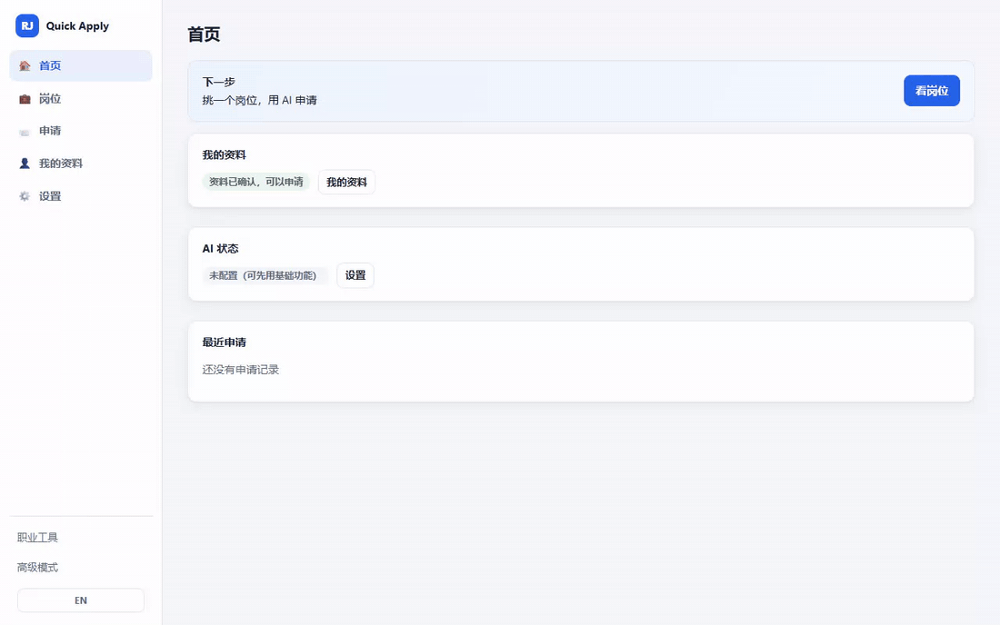

# Resume Jobs AI

> 全网找岗位、每个匹配都**讲得清理由**、定制简历**绝不编造事实**、申请表自动填写——
> 一切都在你自己的电脑上,最后一步永远由**你**点提交。

[](https://nodejs.org/)

[](LICENSE)
[](SECURITY.zh-CN.md)

[English](README.md) · **简体中文**



*22 秒演示,全程使用合成候选人与虚构公司。产品界面里的名字是
**Quick Apply**——同一个产品,只是名字更短。*

## 两分钟试一试

```bash
git clone https://github.com/Kerrylala/resume_jobs_quick_apply.git
cd resume_jobs_quick_apply
npm install && npm run demo
```

演示完全合成、完全离线:假候选人、假岗位、本机上的假申请表单。不读取、不联系、
不提交任何真实的东西。

## 它能做什么

- **全网岗位发现**——搜索公司招聘页和公开的招聘系统(ATS)板块,也可以直接粘贴
  任何公开岗位链接导入。
- **可解释的匹配**——每个分数都拆解成技能、经验、学历、地点、资历五个维度,真实
  的差距会被点名,绝不隐藏。
- **句句有出处的简历与求职信定制**——生成的文档只能说你已批准资料里真实存在的
  内容。AI 编造技能、数字或雇主会被整体拒收,自动回退到确定性版本。
- **申请表自动填写**——用你确认过的答案填表,支持分步向导表单,可以在你自己的
  浏览器(扩展)或一个可见的专用浏览器里进行。
- **答案记忆**——回答过一次的问题,经你确认后会被记住,下次遇到同类问题自动复用。
- **本地优先**——简历、资料、答案、申请历史全是本地文件。AI 可选:接本机模型
  (LM Studio / Ollama)或你自己的 API Key。
- **由你提交**——产品绝不点提交、绝不登录、绝不碰验证码和 MFA。

## 为什么选 Resume Jobs?

大多数自动投递工具是云服务:随意改写你的简历,替你发出你从没看过的申请。这个项目
在每一个取舍上都站在了另一边:

| 常见自动投递机器人 | Resume Jobs |
|---|---|
| 你的简历和历史存在别人的服务器上 | 一切都是你机器上的本地文件 |
| 「93% 匹配」,没有任何理由 | 分数按维度拆解,差距被点名 |
| LLM 随意改写简历——包括编造技能 | 只讲事实:无出处的输出整体拒收,由代码和测试强制执行 |
| 每次申请都从头回答同样的问题 | 确认过的答案带版本管理,自动复用 |
| 替你提交 | 在每个登录、验证码、敏感问题处停下——并且永远停在提交前 |

## 快速开始

环境要求:Windows 11 / macOS / Linux,Node.js 18+,Chrome 或 Edge。

```bash
git clone https://github.com/Kerrylala/resume_jobs_quick_apply.git
cd resume_jobs_quick_apply
npm install
npm start
```

打开 [http://127.0.0.1:8767](http://127.0.0.1:8767),上传一份简历、复核解析结果,
然后点**根据我的资料找工作**。Windows 用户也可以直接双击
`dist/ResumeJobs Launcher.cmd`。完整首次运行流程见
[中文安装指南](docs/user/中文安装指南.md)。

## 截图

所有截图都使用合成候选人与虚构公司。

| 你的资料是唯一事实来源 | 每个匹配都能自证来历 |
|---|---|
|  |  |
| **带评分与筛选的岗位列表** | |
|  | |

求职方向、教育、经历、项目与技能都带版本、可编辑,并直接驱动匹配、定制简历和
搜索。每个岗位都保留它的来历证据——来源、查询词、发现时间、原始链接。与应届生
资料明显不匹配的资深岗位会被挡在**推荐**之外,而不是被悄悄丢掉。

## AI 供应商

AI 可选且默认关闭——不配置 AI,确定性功能本身就是完整的。启用后
([设置](docs/images/settings.zh.png))可以指向:

- **本机模型**:LM Studio 或 Ollama(自动检测);或
- **你自己的 API Key**:OpenAI、Anthropic,或任何 OpenAI 兼容的 HTTPS 端点。

简历定制、求职信和匹配请求只携带岗位描述和该任务确实需要的已确认事实——从不
包含你的联系方式。若在上传简历时启用了 AI,你选择上传的那份简历文本会被发送给
**你自己配置的**供应商,不会去任何别的地方。密钥从不离开你的机器。所有关卡和
审批都由确定性代码掌管:开启 AI 后,匹配分会混入一层明确标注的语义参考意见,但
它永远不能把一个没过硬性门槛的岗位抬进来,也不能批准岗位或推进申请状态。

## 安全与隐私

Resume Jobs 不是一个无人值守的自动投递机器人。

- 绝不自动点击最终提交;登录、验证码、MFA 与各类验证一律停下来交给你。
- 敏感与高风险回答必须经你明确确认。
- 生成的简历和求职信句句有出处:每一句话都能追溯到你批准过的事实。
- 所有个人数据都在被 Git 忽略的本地文件里;克隆这个仓库永远不会带上任何人的
  候选人数据。
- 破坏性操作先归档——**删除全部用户数据**会在清空前把每个数据文件复制到
  `archive/`。

细节与威胁模型:[SECURITY.zh-CN.md](SECURITY.zh-CN.md)。

## 一段话讲清架构

一个本机 Node.js 控制台(无构建步骤)以带版本的 JSON 文件持有全部状态,并提供
中英双语的 Web 界面。匹配、简历解析、定制、搜索规划都是确定性模块,AI 只是其上
一层可选且被严格校验的增强。两个可互换的填写执行器——Chrome 扩展和一个可见的
Playwright 浏览器——共用同一套字段映射、安全策略与报告契约。约 460 条离线测试
钉住全部行为,包括安全规则。深入阅读:
[架构说明](docs/architecture/ARCHITECTURE.md) ·
[产品导览](docs/user/PRODUCT_TOUR.zh-CN.md)。

## 路线图

- **现在**——可解释的搜索与匹配、有出处约束的简历定制(界面中标注实验版)、
  分步表单自动填写、答案记忆、中英双语界面与文档。
- **下一步**——演示视频、更广的 ATS 覆盖与控件支持、打包的一键安装、更多求职信
  风格。
- **以后**——多份职业档案、可插拔的岗位来源、社区共建的字段映射。

## 当前局限

在依赖它之前,这些要如实说:

- 有些门户中途需要登录或人工验证——产品会停下等你,不会尝试绕过。
- ATS 覆盖程度不一:Greenhouse、Lever、Ashby 是一等公民;Workday 仅支持发现;
  少见的自定义控件可能需要手动填写。
- 岗位发现依赖公开来源可访问;需要登录的板块只会以线索形式出现,拿不到完整岗位。
- 简历定制在界面中标注**实验版**:质量取决于你接入的 AI 模型,确定性回退版本的
  文字会更朴素。
- 控制台界面是中英双语的,但页面角标和扩展弹窗目前只有中文。
- 主要在 Windows 上开发和测试;macOS/Linux 跑同一套离线测试,但实战里程更少。
- 最终提交永远是手动的——这是设计,不是缺失的功能。

## 文档与贡献

[产品导览](docs/user/PRODUCT_TOUR.zh-CN.md) ·
[中文安装指南](docs/user/中文安装指南.md) ·
[中文用户指南](docs/user/USER_GUIDE_CN.md) ·
[中文运行指南](docs/user/中文运行指南.md) ·
[扩展指南](docs/user/EXTENSION_GUIDE_CN.md) ·
[浏览器助手指南](docs/user/BROWSER_AGENT_GUIDE_CN.md) ·
[架构说明](docs/architecture/ARCHITECTURE.md) ·
[AI 供应商契约](docs/developer/AI_PROVIDER.md) ·
[文档索引](docs/INDEX.md)

English docs: [README](README.md) · [Contributing](CONTRIBUTING.md) ·
[Security](SECURITY.md) · [Changelog](CHANGELOG.md)

欢迎贡献——从[贡献指南](CONTRIBUTING.zh-CN.md)开始,保持 `npm test` 全绿。
版本说明:[更新日志](CHANGELOG.zh-CN.md) ·
[v1.0.0-rc.1 发布说明](docs/release/V1_RC1_RELEASE_NOTES.md)。

## 许可

[MIT](LICENSE)
